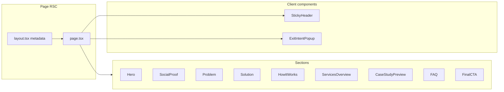

# Landing Page for dammyola.com

## Scope

- **Route:** `/` — replace [src/app/page.tsx](src/app/page.tsx) (currently renders `ComponentExample`).
- **Content source:** All sections and copy from [src/documents/homepage.md](src/documents/homepage.md).
- **Brand:** Use **Dammy Ola** (not "Dammyola") everywhere.
- **Booking URL:** `https://cal.com/dammyola/mvp` for all "Book a Free Consultation" / "Get Started" / "Book a Call" CTAs.
- **Placeholders:** Copy uses `[Client name]`; use placeholder text (e.g. "A Founder") for testimonials/case studies until real names are provided.

## Architecture

- **Root page:** Server Component that composes section components and the sticky header. No data fetching; copy is static.
- **Sections:** Implemented as Server Components (or simple client components only where interactivity is needed). Can live in `src/components/landing/` (e.g. `hero.tsx`, `social-proof.tsx`, …) or inline in `page.tsx`; recommend components for readability and reuse.
- **Sticky header:** Client Component (scroll/visibility or CTA click). Logo/site name + "Get Started" or "Book a Call" linking to `https://cal.com/dammyola/mvp`.
- **Exit-intent popup:** Client Component; optional in first iteration. If included: headline/body from doc, email (required) + optional name, "Download Free Template" CTA.

## Marketing skills to apply

| Skill | How to use it |

|-------|----------------|

| **page-cro** | Treat homepage as main conversion point; primary CTA (Book consultation) clear and repeated; secondary paths (packages, case studies, FAQ) obvious; risk reversal and trust signals per doc. |

| **seo-audit** | SEO is **required**. Implement: crawlable structure, semantic HTML, meta title/description, Open Graph/Twitter, optional JSON-LD (e.g. Organization). No "optional SEO" — baseline SEO in scope. |

| **schema-markup** | Add structured data (e.g. Organization, Service, FAQPage) where it fits; improves SERP and clarity. |

| **copywriting** | Doc already follows strong copy; preserve voice (professional but friendly, founder-friendly, no jargon) when implementing. |

| **frontend-design** | Use for visual direction: distinctive typography, cohesive palette, clear hierarchy, non-generic aesthetic. |

## Section mapping (homepage.md → implementation)

| Doc section | ID / Notes |

| --------------------- | ------------------------------------------------------------------------------------------------------------------------ |

| Hero | Headline Option A, subheadline, primary CTA → `https://cal.com/dammyola/mvp`, secondary "See our packages →" → `#packages` |

| Social proof | "Trusted by founders…", 20+ founders, 6–8 weeks, one testimonial (placeholder name) |

| Problem | "You Have the Idea. But You're Stuck." + bullet list |

| Solution | "We Build Software for Founders…" + What we do / How we're different |

| How it works | 3 steps (Discovery, Proposal, Build & Launch) + CTA → cal.com link |

| Services | "Packages for Founders…" — 4 packages (MVP Builder, AI Add-On, Audit+Fix, Migration) with price ranges, "Get a Quote" → cal.com |

| Case studies | 2 previews (placeholder client names) + "Read Full Case Study" / "See All Case Studies" |

| FAQ | 4 questions (cost, timeline, non-technical, code ownership) + "See All FAQs" / "Book a free consultation" |

| Final CTA | "Ready to Build Your Product?" + primary/secondary CTAs |

| Sticky header | "Get Started" or "Book a Call" → `https://cal.com/dammyola/mvp` |

| Exit popup (optional) | Headline, body, email/name form, "Download Free Template" |

## Design direction

- **Tone:** Professional but friendly; matches "founder-friendly, no jargon" from the doc.
- **Guidance:** Use [frontend-design SKILL](.cursor/skills/frontend-design/SKILL.md): pick one clear direction (e.g. refined minimal with strong typography and one accent color) and avoid generic "AI" look (e.g. default purple gradients, Inter-only).
- **Stack:** Existing [globals.css](src/app/globals.css) (Tailwind, shadcn theme, CSS variables), [Button](src/components/ui/button.tsx), [Card](src/components/ui/card.tsx). Use semantic HTML and section landmarks; keep accessibility (headings, contrast, focus).
- **Layout:** Single column, clear section spacing, responsive. Packages and case studies are good candidates for Card usage; FAQ can be accordion or simple Q/A blocks.

## Links and CTAs

- **Primary CTA "Book a Free Consultation" / "Get Started" / "Book a Call":** `https://cal.com/dammyola/mvp` (use constant e.g. `CONSULTATION_URL` in `src/lib/constants.ts`).
- **"See our packages" / "See Our Packages":** Link to `#packages` (same-page section).
- **"Get a Quote" (per package):** `https://cal.com/dammyola/mvp`.
- **"See All Case Studies" / "Read Full Case Study":** Link to `#case-studies` (or future `/case-studies` when it exists).
- **"See All FAQs" / "See our packages" (in FAQ):** `#faq` and `#packages`.
- **"Download Product Brief Template":** Placeholder (e.g. `#download` or mailto) until a real asset or form exists.

Use Next.js `Link` for internal routes/anchors; `<a href="...">` for `https://cal.com/dammyola/mvp` and other external URLs.

## Metadata and SEO (required)

SEO is **not optional**. Implement:

1. **Metadata** (page or layout): **Title:** "Build Your Product Without Learning to Code | Dammy Ola". **Description:** "We build software and AI products for non-technical founders. From idea to launch in 6–8 weeks. No technical co-founder needed. Book a free consultation."
2. **Open Graph & Twitter:** `openGraph.title`, `openGraph.description`, `openGraph.url` (canonical), `openGraph.type`; Twitter card fields.
3. **Canonical:** Set canonical URL for `/` (e.g. production domain).
4. **Semantic structure:** One `<h1>` (hero headline), logical heading hierarchy, landmarks (`<header>`, `<main>`, `<section>`).
5. **Structured data (schema-markup):** At least Organization (or Person) for Dammy Ola; consider FAQPage for FAQ section.
6. **Technical:** No blocking of `/` in robots.txt; sitemap includes `/` if present.

Reference **seo-audit** and **schema-markup** skills for full checklist. Optional: add `opengraph-image` for `/` when ready.

## File changes summary

| Action | File |

| -------- | -------------------------------------------------------------------------------------------------------------------------------------------------------------------------------------------------------------------------------------------------------------------------- |

| Replace | [src/app/page.tsx](src/app/page.tsx) — import and render all sections + sticky header (and optionally exit popup). |

| Update | [src/app/layout.tsx](src/app/layout.tsx) — set default `metadata.title` and `metadata.description` for the site (or override only on home in `page.tsx`). |

| Create | `src/components/landing/` — one file per section (e.g. `hero.tsx`, `social-proof.tsx`, `problem.tsx`, `solution.tsx`, `how-it-works.tsx`, `packages.tsx`, `case-studies.tsx`, `faq.tsx`, `final-cta.tsx`) plus `sticky-header.tsx` and optionally `exit-intent-popup.tsx`. |

| Create | `src/lib/constants.ts` — `CONSULTATION_URL = "https://cal.com/dammyola/mvp"`, `SITE_NAME = "Dammy Ola"`. |

## Implementation order

1. Add constants: `CONSULTATION_URL = "https://cal.com/dammyola/mvp"`, `SITE_NAME = "Dammy Ola"`. Update root layout metadata (title, description, OG, Twitter, canonical).
2. Build section components in order (Hero → … → Final CTA), using copy from homepage.md and section IDs for anchor links. All primary/secondary CTAs use cal.com or anchors as above.
3. Build sticky header (client component) with "Get Started" or "Book a Call" → `https://cal.com/dammyola/mvp`. Integrate into `page.tsx`.
4. Compose full page in `page.tsx` with semantic structure and anchor IDs.
5. Add required SEO: metadata export, OG/Twitter, canonical, JSON-LD (Organization/Person + optional FAQPage).
6. Optional: implement exit-intent popup and add to page.
7. Final pass: ensure "Dammy Ola" (not "Dammyola") in UI and metadata; verify all CTAs and links; quick CRO and SEO check against skills.

No new routes or APIs are required for the landing page itself; `/packages`, `/case-studies`, and `/faq` can be added later and CTAs updated.
